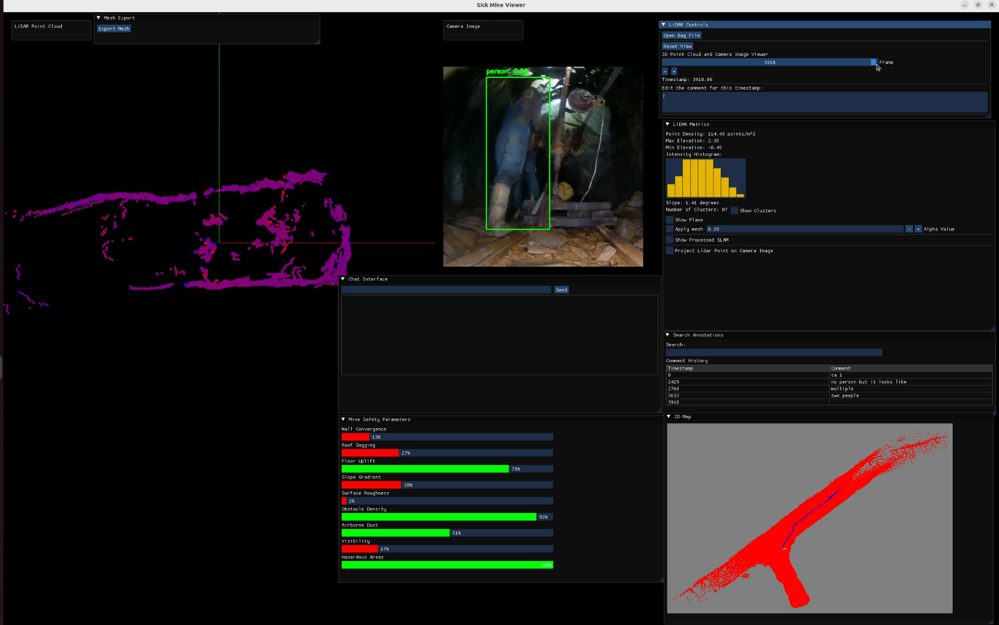

## How to build?
```
mkdir build 
cd build
open3d package should be in the below location -- change the directory accordingly
cmake -DCMAKE_PREFIX_PATH=/home/sujee/open3d_install/lib/cmake/Open3D ..
make
```

## How to run?
```
source /opt/ros/humble/setup.bash -- ros dependent libraries
./sick_app
```
[Submission](https://youtu.be/Kd0WLjaqSZQ)

* <b>Starting point of the code is main.cpp which calls main.py as well using pybind method.</b>

<p align="center">
  
</p>

<p align="center">
  
</p>

